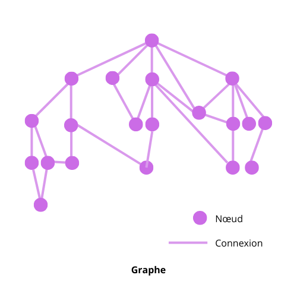
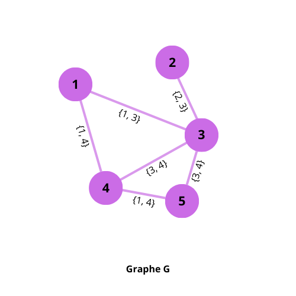
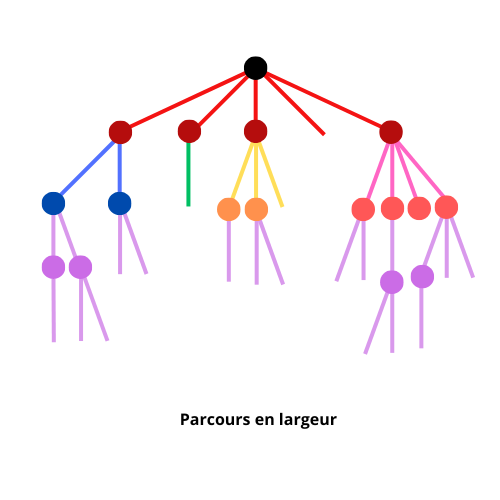
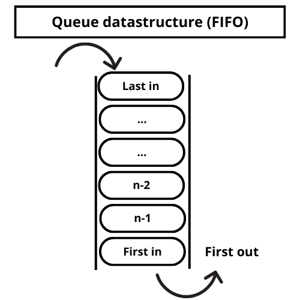
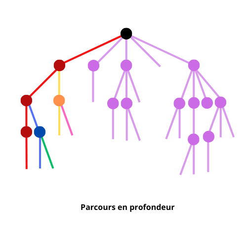
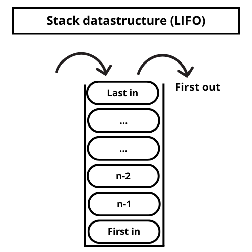

# Graphes : fondamentaux

## Les Graphes

un graphe est une structure mathématique (mathématiques *discrètes*) constituée de deux éléments :

* les nœuds (ou sommets)
* les connexions (ou arêtes), chacune associée à une paire de sommets



Formellement, on définit un graphe par la liste de ses nœuds, et la liste des connexions entre ces nœuds. On pourrait donc définir le graphe G ainsi :

G = ({1, 2, 3, 4, 5}, {1,3}, {1,4}, {2,3}, {3, 4}, {3, 5}, {4,5}) :



Les graphes peuvent être caractérisés plus précisément. On peut affecter des poids ou un sens (ou direction) aux connexions. On peut classer les graphes en fonction de leur propriétés (arbres, chaînes, cycles…). 

Les graphes sont des structures de données extrêmement importantes en algorithmique, et notamment en intelligence artificielle. Qu’il s’agisse d’une approche classique, symbolique (telle que nous allons l’étudier dans ce cours) de résolution de problèmes ou d’une approche connexionniste (*deep learning*, avec notamment des *graph neural network – GNN*). Ce genre de structure est également importante dans la création de bases de connaissances, l’analyse de donnée, dans les réseaux (routage), etc.

Ressources : [la page Wikipedia sur les graphes](https://fr.wikipedia.org/wiki/Graphe_(math%C3%A9matiques_discr%C3%A8tes))

Louis Frécon, Éléments de mathématiques discrètes – Presses Polytechniques et Universitaires Romandes, 2002

## Parcours en largeur (BFS)

Souvent, résoudre un problème à l’aide de graphe consistera à rechercher un nœud en particulier (rechercher un état / solution, trouver un chemin, etc.), et donc de parcourir un graphe. Dans un premier temps, nous allons voir comment on parcours un graphe de manière exhaustive (on va chercher à atteindre tous les nœuds du graphe). Nous verrons plus tard des méthodes qui permettent de rechercher un cheminement précis dans un graphe en ignorant volontairement d’autres chemins selon certains critères, afin d’économiser du temps de calcul et donc réaliser un arbitrage en faveur de l’efficacité (bénéfice/risque).

Il existe plusieurs manière de parcourir les graphes. Le parcours en largeur (*Breadth First Search, BFS*) est l’une d’entre elle. Elle consiste à parcourir le graphe « de gauche à droite », par exemple dans le cas particulier d’un arbre :



Une fois qu’on a visité un nœud, on commence par visiter tous ses voisins (nœuds adjacents), puis les voisins des voisins, etc.

Le BFS est intéressant notamment dans les algorithmes de pathfinding, quand on cherche les plus courts chemins (cf. Dijkstra).

La complexité algorithmique du BFS est proportionnelle au nombre de sommets et de relations dans le graphe. Le BFS a tendance à consommer beaucoup de mémoire par rapport à d’autres algorithmes : on mémorise tous les nœuds les uns après les autres avant de visiter les suivants, cela demande donc de conserver en mémoire beaucoup de références.

### Les queues (ou files d’attentes)

Les queues sont des structures de données qui obéissent au principe FIFO (*First In, First Out*).



La file d’attente sera la structure de donnée dans laquelle on va stocker les nœuds qu’on visitera avec un BFS, vu qu’une fois qu’un nœud sera enregistré comme voisin à visiter, on va explorer les autres voisins avant d’y revenir pour explorer à leur tour les voisins de ce nœud. On met donc les voisins « en attente » au fur et à mesure dans une file, et on les retire de la queue dès que tous leurs voisins auront été explorés.

### Pseudo-code 

Le principe est très simple : 

* on prend le premier nœud d’un graphe (défini par une liste de nœud et la liste des voisins de chaque nœud), on le place dans une queue

* tant qu’il reste des éléments dans la queue :

  - on retire de la queue le (premier) nœud

  - on affiche cet élément (ou on réalise toute autre opération que l’on souhaite effectuer sur les nœuds de notre graphe)

  - pour chaque voisin de ce nœud :
    - on vérifie que ce nœud voisin n’a pas déjà été vu
    - si non : on indique que ce voisin vient d’être vu
    - et on l’ajoute à la queue

```
graphe = liste_nœuds, liste_voisins

queue_ajouter(premier_element(graphe.liste_nœud))

tant_que queue.non_vide:
	nœud_actuel = queue.retirer_element
	afficher(nœud_actuel)
	pour chaque voisin dans queue.liste_voisins:
		si voisin.non_visité:
			voisin.visité = vrai
			queue.ajouter_element(voisin)

```


### Code en Lua

```lua
Queue = require "queue" -- module to manage queue
Object = require "classic" -- module to manage classes/objects in Lua

Node = Object:extend() -- create an Node class

function Node:new(name) -- Node class constructor
    self.name = name
    self.lst_neighbours = {}
    self.visited = false
end

function breadth_first_search(start)
    local queue = Queue()
    
    -- insert the first node in queue (will be the first taken out)
    queue:enqueue(start)

    -- keep iterating (looking up for neighbours) until queue is empty
    while queue.empty == false do
        -- remove first/older item inserted in queue, we will consider its neighbours
        current_node = queue:dequeue()
        -- do things with the current node
        print(current_node.name)

        -- iterate through its adjacent nodes (neighbours)
        for _, neighbour in ipairs(current_node.lst_neighbours) do
            -- if the adjacent nodes have not been visited yet, then insert them into queue
            if neighbour.visited == false then
                -- we set the node to visited
                neighbour.visited = true
                -- insert it into queue
                queue:enqueue(neighbour)
            end
        end
    end
end

-- TEST 
-- Create nodes with names
nodeA = Node('A')
nodeB = Node('B')
nodeC = Node('C')
nodeD = Node('D')
nodeE = Node('E')


table.insert(nodeA.lst_neighbours, nodeB)
table.insert(nodeA.lst_neighbours, nodeD)
table.insert(nodeB.lst_neighbours, nodeD)
table.insert(nodeD.lst_neighbours, nodeC)
table.insert(nodeD.lst_neighbours, nodeE)


breadth_first_search(nodeA)
```

Le module `queue` :

```lua
-- This module implements a Queue class that behave like a queue
-- inspired from the book « Programming in Lua » https://www.lua.org/pil/11.4.html

Object = require 'classic' -- module to manage classes/objects in Lua

Queue = Object:extend() -- create a Queue class

function Queue:new() -- Queue class constructor
  self.first = 0
  self.last = -1
  self.data = {} 
  self.empty = true
end

function Queue:enqueue(value) -- enqueue method
    self.last = self.last + 1
    self.data[self.last] = value
    self.empty = false
end

function Queue:dequeue() -- dequeue method
    local value
    if self.first > self.last then
        error('list is empty')
    else
        value = self.data[self.first]
        self.data[self.first] = nil
        self.first = self.first + 1
        if self.first > self.last then
            self.empty = true
        end
    end
    return value
end

function Queue:print_elements()
    for i = 0, #queue.data do
        print(queue.data[i])
    end
end


--[[test 
queue = Queue()
print('enqueue A')
queue:enqueue('A')
print('enqueue B')
queue:enqueue('B')
print('enqueue C')
queue:enqueue('C')

queue:print_elements()

print('queue.first', queue.first)
print('queue.last', queue.last)
print('queue empty', queue.empty)


repeat
    local x = queue.data[queue.first]
    print('dequeue ', x)
    print(queue:dequeue(), 'dequeued')
until (queue.first > queue.last)
print('queue.first', queue.first)
print('queue.last', queue.last)
print('queue empty', queue.empty)


queue:print_elements()

queue:enqueue('A')
print(queue.data[queue.first])
print(queue.data[queue.last])
print(#queue.data)
print('queue empty', queue.empty)


queue:dequeue()
print(queue.data[queue.first])
print(queue.data[queue.last])
print(#queue.data)
print('queue.first', queue.first)
print('queue.last', queue.last)
print('queue empty', queue.empty)
--]]

return Queue 
```

Vous pouvez obtenir le module `classic`  ([MIT license](https://mit-license.org/)) sur  [le dépôt GitHub de son créateur](https://github.com/rxi/classic/tree/master).

## Parcours en profondeur (DFS)

Dans le cas d’un parcours en profondeur on va suivre une branche « de haut en bas » plutôt que de gauche à droite. Par exemple dans le cas particulier d’un arbre : 



Alors qu’avec le BFS on visitait tous les voisins (nœuds adjacents) d’un nœud, puis les voisins des voisins, etc., dans le DFS, à partir d’un premier nœud, on visite son premier voisin, puis le 1er voisin de ce voisin, puis le 1er… et ensuite le 2d  voisin, etc.

La complexité du DFS, comme celle du BFS, est proportionnelle au nombre de sommets et de relations dans le graphe. Par contre, le DFS consomme beaucoup moins de mémoire que le BFS, car les références stockées sont libérées au fur et à mesure de l’exploration (on ne revient plus à une branche déjà explorée).

Nous allons souvent faire appel à cette manière de parcourir les arbres, par exemple pour le backtracking ou le MiniMax.

### Les piles

Une pile (*stack*) est une structure de donnée qui obéit au principe LIFO (*Last In, First Out*)



La pile sera la structure de donnée dans laquelle on va stocker les nœuds qu’on visitera : on mettra un premier nœud dans la pile, puis sont 1er voisin, puis le 1er voisin du voisin, etc. et les nœuds seront retirés au fur et à mesure que l’on attendra l’extrémité d’une branche, on qu’on rencontrera un voisin déjà visité, ce qui correspondra à un retour en arrière (backtracking), et on explorera les voisins suivants.

### Pseudo-code

L’algorithme DFS est similaire (sinon identique) au BFS, excepté qu’à la place d’une queue, on utilise une pile pour stocker les nœuds visités :

* on prend le premier nœud d’un graphe (défini par une liste de nœud et la liste des voisins de chaque nœud), on le place dans une pile

* tant qu’il reste des éléments dans la pile :

  - on retire de la pile le (dernier) nœud

  - on affiche cet élément (ou on réalise toute autre opération que l’on souhaite effectuer sur les nœuds de notre graphe)

  - pour chaque voisin de ce nœud :
    - on vérifie que ce nœud voisin n’a pas déjà été vu
    - si non : on indique que ce voisin vient d’être vu
    - et on l’ajoute à la pile

```
graphe = liste_nœuds, liste_voisins

pile.ajouter_element(premier_element(graphe.liste_nœuds))

tant que non_vide(pile):
	nœud_courant = pile.retirer_element()
	afficher(nœud_actuel)
	pour chaque voisin dans pile.liste_voisins:
		si voisin.non_visité:
			voisin.visité = vrai
			pile.ajouter_element(voisin)

```

### Code en Lua

Il y a deux manière d’implémenter cet algorithme :

+ soit en implémentant notre propre mécanisme de pile (comme nous l’avons fait pour les queues)
+ soit en utilisant la pile du système, en utilisant une fonction récursive

#### Pile maison

Voyons la première méthode :

```lua
Object = require 'classic' -- module to manage classes/objects in Lua
Stack = require 'stack' -- module to manage stacks

Node = Object:extend() -- create node class

function Node:new(name) -- node class constructor
    self.name = name
    self.lst_neighbours = {}
    self.visited = false
end

function depth_first_search(start)
    local stack = Stack()

    -- push the first node in stack (wil be the last taken out)
    stack:push(start)

    -- keep iterating (looking up for neighbours) 
    while stack.empty == false do
        -- remove last/most recent item in stack, we will consider its neighbours
        current_node = stack:pop()
        -- do things with current node
        print(current_node.name)

        -- iterate through its adjacent nodes (neighbours)
        for _, neighbour in ipairs(current_node.lst_neighbours) do
            -- if the adjacent nodes have not been visited yet, then push them in stack
            if neighbour.visited == false then
                -- we set the node to visited
                neighbour.visited = true
                -- push them into stack
                stack:push(neighbour)
            end
        end
    end
end


-- TEST 1
print('TEST depth_first_search()')
-- Create nodes with names
nodeA = Node('A')
nodeB = Node('B')
nodeC = Node('C')
nodeD = Node('D')
nodeE = Node('E')
nodeF = Node('F')
nodeG = Node('G')

table.insert(nodeA.lst_neighbours, nodeB)
table.insert(nodeA.lst_neighbours, nodeC)
table.insert(nodeA.lst_neighbours, nodeD)
table.insert(nodeB.lst_neighbours, nodeE)
table.insert(nodeE.lst_neighbours, nodeG)
table.insert(nodeC.lst_neighbours, nodeF)


depth_first_search(nodeA)
```

Avec le module `stack` :

```lua
Object = require 'classic' -- module to manage classes/objects in Lua

Stack = Object:extend() -- create Stack class

function Stack:new() -- Stack class constructor
    self.data = {}
    self.empty = true
end

function Stack:push(value)
    self.data[#self.data + 1] = value
    self.empty = false
end

function Stack:pop()
    if #self.data <= 0 then
        error('stack is empty')
    end
    local value = self.data[#self.data]
    self.data[#self.data] = nil
    if #self.data < 1 then
        self.empty = true
    end
    return value
end

function Stack:print_elements()
    for i = #self.data, 1, -1 do
        print(self.data[i])
    end
end

--[[ TEST

stack = Stack()
print('push A')
stack:push('A')
print('push B')
stack:push('B')
print('push C')
stack:push('C')

print('Elements pushed in stack:')
stack:print_elements()

print('pop last element:')
print(stack:pop())
print('pop last element:')
print(stack:pop())
print('pop last element:')
print(stack:pop())

print('Remaining elements in stack:')
stack:print_elements()
]]

return Stack
```

Vous pouvez obtenir le module `classic`  ([MIT license](https://mit-license.org/)) sur  [le dépôt GitHub de son créateur](https://github.com/rxi/classic/tree/master).

#### Fonction récursive

Avec une fonction récursive, on fait appel en fait à la pile du système, le code est alors nettement plus court (mais moins compréhensible) :

```lua
function rec_depth_first_search(start)
    start.visited = true
    print(start.name)
    
    for _, neighbour in ipairs(start.lst_neighbours) do
        if neighbour.visited == false then
            rec_depth_first_search(neighbour)
        end
    end
end
```


## Backtracking

Première approche du pathfinding.

On a un point de départ et une arrivée dans un labyrinthe, utilisons un algorithme de backtracking avec un DFS pour explorer le labyrinthe et trouver notre chemin.

### Pseudo code

```
trouver_solution():
    si résoudre(0, 0) alors  # (0, 0) est le point de départ
        afficher_solution()
    sinon
        afficher('Pas de solution')
        
        
résoudre(x, y):

    si atteint_destination(x, y):
        retourne vrai
    
    si est_valide(x, y) et que non_visité(x, y) # valide = pas sur un mur, pas en dehors du labyrinthe
        mémoriser_visite(x,y)
        marquer_solution(x, y)

		# on entame des appels récursifs pour explorer les différentes directions
        si résoudre(x, y+1) alors
            retourne vrai

        si résoudre(x, y-1) alors
            retourne vrai

        si résoudre(x+1, y) alors
            retourne vrai

        si résoudre(x-1, y) alors
            retourne vrai

        marquer_pas_solution(x,y)
    retourne faux


atteint_destination(x, y):

    si x == destination_x and y == destination_y alors
        marquer_solution(x, y)
        retourne vrai
    
    retourne faux


est_valide(x, y):

    # on vérifie qu’on n’est pas sorti horizontalement du labyrinthe
    si x < 0 ou x > largeur_labyrinthe alors
        retourne faux
    # on vérifie qu’on n’est pas sorti verticalement du labyrinthe 
    si y < 0 ou y > hauteur_labyrinthe alors
        retourne faux
    # on vérifie qu’on n’est pas sur un mur
    si labyrinthe(x, y) == mur alors
        retourne faux
    
    retourne vrai
    


```


### Code en Lua

Dans un premier temps, faisons une implémentation toute simple (pas de mémorisation, exploration limitée dans deux directions)

```lua
local maze = {
    {'_', '_', '_', '_', '_', '_', '_', '_'},
    {'|', 'D', '*', ' ', ' ', ' ', '*', '|'},
    {'|', ' ', ' ', '*', '*', ' ', ' ', '|'},
    {'|', '*', ' ', ' ', ' ', ' ', ' ', '|'},
    {'|', '*', '*', '*', ' ', '*', '*', '|'},
    {'|', '*', ' ', ' ', ' ', ' ', ' ', '|'},
    {'|', ' ', ' ', '*', '*', ' ', ' ', '|'},
    {'|', '*', ' ', ' ', '*', ' ', ' ', '|'},
    {'|', '*', '*', ' ', ' ', ' ', 'A', '|'},
    {'¯', '¯', '¯', '¯', '¯', '¯', '¯', '¯'}
}

-- we will work on a copy of the maze to write our solution we will need a
-- function to copy tables by value (recursively, to copy as well tables within tables -> "deep")
function deepCopy(table_to_copy)
    local copy = {}
    for k, v in pairs(table_to_copy) do
        if type(v) == 'table' then
            copy[k] = deepCopy(v)  -- Recursive call
        else
            copy[k] = v
        end
    end
    return copy
end

local solution = deepCopy(maze)


function disp_maze(p_maze)

    for _, l in ipairs(p_maze) do 
        local s = ''
        for _, c in ipairs(l) do
            s = s..c
        end
        print(s)
    end
end


function found_end(x, y)

    if maze[y][x] == 'A' then
        solution[y][x] = '▮'
        return true
    end

    return false

end


function valid(x, y)

    if x < 2 or x > #maze[y]-1 then
        return false
    end

    if y < 2 or y > #maze-1 then
        return false
    end

    if maze[y][x] == '*' then
        return  false
    end

    return true

end


function solve(x, y)

    if found_end(x, y) then
        return true
    end

    if valid(x, y) then
        solution[y][x] = '▮'
        
        if solve(x, y+1) then
            return true
        end

        if solve(x+1, y) then
            return true
        end

    end

    return false

end


function find_solution()
    x = 2
    y = 2

    if solve(pos.x, pos.y) then
        disp_maze(solution)
    else
        print('The maze has no solution.')
    end

end

print('Maze:')
disp_maze(maze)
print('Solution:')
find_solution(maze)
```

Quelles sont les limites de cette implémentation ?

Modifions le labyrinthe un petit peu :

```lua
local maze = {
    {'_', '_', '_', '_', '_', '_', '_', '_'},
    {'|', 'D', '*', ' ', ' ', ' ', '*', '|'},
    {'|', ' ', ' ', ' ', '*', ' ', ' ', '|'},
    {'|', '*', ' ', '*', ' ', ' ', ' ', '|'},
    {'|', '*', '*', '*', ' ', '*', '*', '|'},
    {'|', '*', ' ', ' ', ' ', ' ', ' ', '|'},
    {'|', ' ', ' ', '*', '*', ' ', ' ', '|'},
    {'|', '*', ' ', ' ', '*', ' ', ' ', '|'},
    {'|', '*', '*', ' ', ' ', ' ', 'A', '|'},
    {'¯', '¯', '¯', '¯', '¯', '¯', '¯', '¯'}
}
```

Même si le labyrinthe a encore une solution, notre programme ne la trouve pas : comme il n’explore que vers la droite, puis vers le bas, il ne peut pas prendre un chemin vers le haut pour contourner un obstacle.

Dotons donc notre explorateur de la capacité d’aller dans les 4 directions.

### Code en Lua, déplacement dans les 4 directions

```lua
local maze = {
    {'_', '_', '_', '_', '_', '_', '_', '_'},
    {'|', 'D', '*', ' ', ' ', ' ', '*', '|'},
    {'|', ' ', ' ', ' ', '*', ' ', ' ', '|'},
    {'|', '*', ' ', '*', ' ', ' ', ' ', '|'},
    {'|', '*', '*', '*', ' ', '*', '*', '|'},
    {'|', '*', ' ', ' ', ' ', ' ', ' ', '|'},
    {'|', ' ', ' ', '*', '*', ' ', ' ', '|'},
    {'|', '*', ' ', ' ', '*', ' ', ' ', '|'},
    {'|', '*', '*', ' ', ' ', ' ', 'A', '|'},
    {'¯', '¯', '¯', '¯', '¯', '¯', '¯', '¯'}
}


-- function to copy tables by value (recursively, to copy as well tables within tables -> "deep")
function deepCopy(table_to_copy)
    local copy = {}
    for k, v in pairs(table_to_copy) do
        if type(v) == 'table' then
            copy[k] = deepCopy(v)  -- Recursive call
        else
            copy[k] = v
        end
    end
    return copy
end


local solution = deepCopy(maze)


function disp_maze(p_maze)

    for _, l in ipairs(p_maze) do 
        local s = ''
        for _, c in ipairs(l) do
            s = s..c
        end
        print(s)
    end
end


function found_end(x, y)

    if maze[y][x] == 'A' then
        solution[y][x] = '▮'
        return true
    end

    return false

end


function valid(x, y)

    if x < 2 or x > #maze[y]-1 then
        return false
    end

    if y < 2 or y > #maze-1 then
        return false
    end

    if maze[y][x] == '*' then
        return  false
    end

    return true

end


function solve(x, y)
-- uncomment if you want to follow the algorithm progression
    print(x)
    print(y)
    disp_maze(solution)
    print('---')
 

    if found_end(x, y) then
        return true
    end

    if valid(x, y) then
        solution[y][x] = '▮'
        
        if solve(x, y+1) then
            return true
        end

        if solve(x+1, y) then
            return true
        end
        
        if solve(x, y-1) then
            return true
        end


        if solve(x-1, y) then
            return true
        end

        solution[y][x] = '·'

    end

    return false

end


function find_solution()
    x = 2
    y = 2

    if solve(x, y) then
        disp_maze(solution)
    else
        print('The maze has no solution.')
    end

end

print('Maze:')
disp_maze(maze)
print('Solution:')
find_solution(maze)
```

Notre programme recherche une solution plus longtemps… et fini par planter (le fameux `stack overflow`).

Que se passe-t-il ? En fait quand notre explorateur est coincé vers le bas et la droite, il peut remonter, mais il explore sans cesse les mêmes nœuds ! Il ne se rappelle pas qu’il est déjà passé par un nœud, donc est susceptible de revenir dessus sans cesse !

Dotons donc notre programme de la capacité de se rappeler par quels nœuds il est déjà passé.

### Code en Lua, avec mémorisation

```lua
local maze = {
    {'_', '_', '_', '_', '_', '_', '_', '_'},
    {'|', 'D', '*', ' ', ' ', ' ', '*', '|'},
    {'|', ' ', ' ', ' ', '*', ' ', ' ', '|'},
    {'|', '*', ' ', '*', ' ', ' ', ' ', '|'},
    {'|', '*', '*', '*', ' ', '*', '*', '|'},
    {'|', '*', ' ', ' ', ' ', ' ', ' ', '|'},
    {'|', ' ', ' ', '*', '*', ' ', ' ', '|'},
    {'|', '*', ' ', ' ', '*', ' ', ' ', '|'},
    {'|', '*', '*', ' ', ' ', ' ', 'A', '|'},
    {'¯', '¯', '¯', '¯', '¯', '¯', '¯', '¯'}
}

-- function to copy tables by value (recursively, to copy as well tables within tables -> "deep")
function deepCopy(table_to_copy)
    local copy = {}
    for k, v in pairs(table_to_copy) do
        if type(v) == 'table' then
            copy[k] = deepCopy(v)  -- Recursive call
        else
            copy[k] = v
        end
    end
    return copy
end


local solution = deepCopy(maze)

local visited = {}


function isVisited(x, y)
    -- we name keys by combining the coordinates of the node marked (easier retrieving) 
    local key = x .. "," .. y
    return visited[key] == true
end


function markVisited(x, y)
    local key = x .. "," .. y
    visited[key] = true
end


--[[ -- in some cases we may need to unmark a visited node () (not the case here)
function unmarkVisited(x, y)
    local key = x .. "," .. y
    visited[key] = nil -- or false
end
]]

function disp_maze(p_maze)

    for _, l in ipairs(p_maze) do 
        local s = ''
        for _, c in ipairs(l) do
            s = s..c
        end
        print(s)
    end
end


function found_end(x, y)

    if maze[y][x] == 'A' then
        solution[y][x] = '▮'
        return true
    end

    return false

end


function valid(x, y)

    if x < 2 or x > #maze[y]-1 then
        return false
    end

    if y < 2 or y > #maze-1 then
        return false
    end

    if maze[y][x] == '*' then
        return  false
    end

    return true

end


function solve(x, y)
--[[ uncomment if you want to follow the algorithm progression
    print(x)
    print(y)
    disp_maze(solution)
    print('---')
    ]]

    if found_end(x, y) then
        return true
    end

    if valid(x, y) and not isVisited(x, y) then
        markVisited(x, y)
        solution[y][x] = '▮'
        
        if solve(x, y+1) then
            return true
        end

        if solve(x+1, y) then
            return true
        end
        
        if solve(x, y-1) then
            return true
        end


        if solve(x-1, y) then
            return true
        end

        solution[y][x] = '·'

    end

    return false

end


function find_solution()
    x = 2
    y = 2

    if solve(x, y) then
        disp_maze(solution)
    else
        print('The maze has no solution.')
    end

end

print('Maze:')
disp_maze(maze)
print('Solution:')
find_solution(maze)
```

Ça marche ! On voit même apparaître les endroits où l’explorateur a été coincé (marqués par le caractère `'·'`, et qu’il a repris l’exploration du graphe d’un nœud antérieur.

Néanmoins cet algorithme n’est pas parfait pour retrouver son chemin :

* il explore les directions toujours dans le même ordre
* il ne prend pas forcément le chemin le plus court
* l’exploration est systématique, ce qui n’est pas forcément efficace
* si le labyrinthe a plusieurs solutions, il ne reviendra jamais en arrière. Pour cela il faudrait « oublier » un nœud déjà exploré (d’où la fonction `unmarkVisited()`, mais à bon escient : comment savoir ?)

Il est temps d’étudier des algorithmes de *pathfinding* plus efficaces !