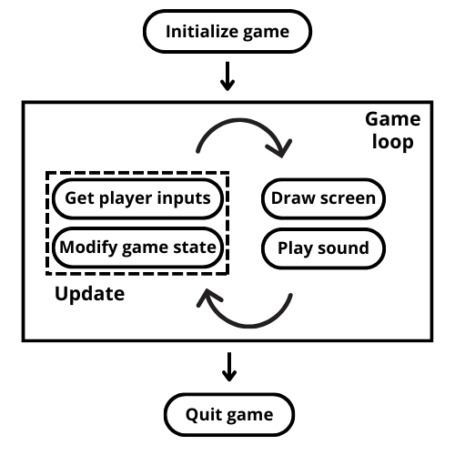

# Les spécificités du Lua et de Löve 2D

Ce fichier n’est pas un cours mais contient des notes pas toujours très structurées mais qui devraient néanmoins vous permettre de mieux prendre en main Lua et Löve2D si vous décidez de les adopter pour les exemples et projets de ce cours. N’hésitez pas à parcourir ces notes si vous constatez un comportement bizarre de votre code en Lua.

## Ressources

### Lua

Ce n’est pas forcément un langage très répandu, mais qui gagne à être connu. Notamment si on s’intéresse aux jeux vidéos et au scripting, domaines dans lesquels il a obtenu une réelle reconnaissance. Voici quelques ressources :

[Learn Lua in y minutes](https://learnxinyminutes.com/fr/lua/). learnxinyminutes.com est un super site pour apprendre les bases de n’importe quel langage et de certains outils (vim, tmux…) de manière condensée.

Le site [lua-users.org](http://lua-users.org/wiki/LuaTutorial) et ses tutoriels est une ressource de choix.

[Programming in Lua](https://www.lua.org/pil/) est l’ouvrage de référence, par le créateur du langage. [LuaJIT](https://luajit.org/) (utilisé par Löve2D) est compatible avec Lua 5.1, décrit dans la seconde édition du livre. Le manuel de référence de Lua 5.1 [est disponible en ligne](https://www.lua.org/manual/5.1/).

Je recommande l’installation de [Zeal](https://zealdocs.org/), qui permet consulter en local la doc de nombreux langages et bibliothèques, dont les différentes versions de Lua, dont la 5.1.

Le seul ouvrage de référence en français sur le Lua (en deux tomes) : *Le Guide de Lua et ses applications*, Sylvain  Fabre et al. – Éditions de Booker, 2d éd., 2016.

#### Pourquoi choisir Lua ?

C’est un langage très léger (<1.3Mo), très rapide pour un langage interprété, très lisible et facile à apprendre, conçu pour être utilisé par des non-spécialistes du développement (d’où certaines bizarrerie comme l’index des tableaux qui débute à 1). 

Dans une certaine mesure, le Lua a une petite place parmi les standards de l’industrie : 

* comme son API C est très transparente, il est souvent utilisé comme langage de script, l’exemple le plus fameux étant World of Warcraft, mais aussi Civilization, Angry Birds, etc. Souvent les moteurs d’IA dans les jeux vidéos sont scriptés d’ailleurs (pour faciliter le paramétrage). 
* le Lua permet ainsi souvent de réaliser des mods (cf. [Garry’s Mod](https://gmod.facepunch.com/))
* [Céleste](https://www.celestegame.com/) a originellement été développé sur [PICO-8](https://www.lexaloffle.com/pico-8.php), une fantasy console dont l’environnement de développement est en Lua. 
* [Roblox](https://www.roblox.com/fr) utilise un langae dérivé du Lua : le [Luau](https://luau.org/). 
* Il existe des moteurs de jeux comme [Defold](https://defold.com/) qui permettent de développer des jeux en cross-platform
* [Corona SDK](https://coronalabs.com/) était un autre environnement qui permet de faire du cross-platform, aujourd’hui [Solar2D](https://solar2d.com/) est un fork sous licence MIT.
* [Codea](https://codea.io/) permet de coder des jeux directement sur iPhone ou iPad
* Lua peut être utilisé aussi sur des microcontroleurs (script pour Lego Mindstorm par exemple, MicroLua pour RP2040/Pico)

### Löve2D

C’est un framework de développement de jeux vidéos en 2D. Comparable à PyGame en Python, mais beaucoup plus facile à prendre en main et performant !

https://love2d.org/ propose pour Windows une version installable (attention au Path) et une version portable (un simple zip a télécharger).

Pour Linux, une AppImage est disponible (seulement en 64bits), sinon un dépôt existe pour Ubuntu. 

#### Ressources

Le site officiel propose un wiki qui liste très clairement les différentes fonctions de Löve2D avec de nombreux exemples et ressources, dont des tutoriels en français https://www.love2d.org/wiki/Main_Page

[La chaîne youtube de CS50](https://www.youtube.com/@cs50) (le cours de science informatique d’Harvard) propose plusieurs séries de cours sur la création de jeux vidéos avec Löve2D (les vidéos commencent à dater, il est vrai).

Un livre en français : *Initiation à la création de jeux vidéo avec LÖVE2D*, par Anthony Cardinale - Éditions D-Booker. Création d’une base de RPG avec Löve2D. 

[Quelques ateliers](https://github.com/aucoindujeu/codeclub/tree/main?tab=readme-ov-file) que j’ai écrit pour un *code club* de lycéens que je co-anime (work in progress), aller dans le répertoire `love2d`.

#### Pourquoi choisir Löve2D?

C’est un framework libre et facile à prendre en main. Basé sur [LuaJIT](https://luajit.org/) et la [SDL2](https://www.libsdl.org/), il offre d’excellentes performance pour un poids très léger. Il existe de nombreuses ressources en ligne, et il est très populaire dans le milieu du développement des jeux indé. [Balatro](https://www.playbalatro.com/) a été initialement développé avec Löve2D. Des [game jams](https://itch.io/jam/love2d-jam-2025) dédiées ont lieu régulièrement. Il est très agréable pour le prototypage, et donc idéal pour les exemples et projets de ce cours.

## Spécificités de Lua

### Portée des variables

Par défaut les variables sont globales. Il faut les faire précéder du mot clé `local` pour qu’elle soit limitée à la portée du bloc courant (fichier, fonction, boucle…). Attention car si vous oubliez de déclarer une variable locale, ça peut parfois être très difficile à debugger (notamment dans le cas des fonctions récursives, que nous allons utiliser intensément dans ce cours).

```lua
a = 1 -- variable globale
local a = 1 -- variable limitée à la portée en cours
```

### Variables indéfinies

Si une variable est appelée alors qu’elle n’a jamais été assignée (cas typique : une faute de frappe dans le nom de la variable), cela ne soulèvera pas forcément une erreur car elle aura par défaut la (non) valeur `nil`. Par exemple :

```lua
var = 1

if vzr == 1 then
    print('ok')
 else
    print('pas ok')
 end
```

ne retournera pas d’erreur, mais affichera `'pas ok'`. Une erreur ne sera soulevée que si la valeur `nil` est incompatible avec ce que vous demandez au programme de faire. Attention à ce piège très courant (et pas toujours  facile à détecter).

### Importer un module

Si vous appréciez la modularité quand vous codez ou que vous voulez importer un module, il faudra utiliser le mot clé `require()`

```lua
require('nom_du_module')
```

exécutera le fichier `nom_du_module.lua`. Vous remarquerez qu’on omet l’extension `.lua`.

L’usage est qu’un module retourne une table qui contient les données, fonctions, etc. que l’on souhaite utiliser en important le module. C’est pour cela qu’on stocke l’output de `require()` dans une variable généralement :

```lua
local imported_module = require('nom_du_module')

imported_module.module_function() -- appelle la fonction module_function() du module que l’on a importé
```

### Le mot clef `end`

Une erreur courante est d’oublier le mot clef `end` pour clore une fonction, une boucle, un test conditionnel…

### Entrée console

Pour lire l’entrée standard (console), il faut utiliser la fonction `io.read()`. La fonction `io.input()` sert à lire des fichiers.

Attention `io.read()` retourne un type chaîne de caractères, penser à convertir les types, par exemple avec `tonumber()` si on attend un type nombre.:w

### Concaténation de chaînes

L’opérateur de concaténation est `..` :

```lua
a = 'Nom'
b = 'Prénom'

print(a..' '..b)

--[[
Retournera 

Nom Prénom
]]
```


###  Les tables

`table` est la structure de donnée à tout faire en Lua : listes, tableaux, dictionnaires… on peut même utiliser une de ses propriétés pour mettre en œuvre un formalisme approchant la programmation orientée objet en Lua. Mais cette structure a ses spécificités. Je la présente en détail car nous allons en faire un usage intensif.

#### Histoire d’index

##### Index

L’index des tables commencent à 1 (et non à 0) :

```lua
liste = {'a', 'b', 'c'}
print(liste[0]) -- retournera 'nil' (et non une erreur)
print(liste[1]) -- retournera 'a'
print(#liste) -- retournera 3, # permet d’obtenir la longeur d’une table
```

C’est très perturbant pour certains.

##### Listes et dictionnaires

Les tables peuvent se comporter comme des dictionnaires.

```lua
t = {}
t['key1'] = 2
t['key2'] = 'value'
t[3] = 'value2'
print(t['key1']) -- retournera 2
print(t.key2) -- retournera 'value', remarquer la syntaxe particulière, ne fonctionne qu’aver les clefs/string
print(t['key3']) -- retournera 'nil' !

tab = {['key1']=1, ['key2']=3, ['key3']=5}
print(tab.key3) -- retournera 5
```

En réalité, quand on utilise des tables en tant que listes, cela reste un dictionnaire où les clefs sont des entiers, en fait la déclaration sous forme de liste est juste un raccourci pour écrire :  

```lua
liste = {[1]='a', [2]='b', [3]='c'}
```

Néanmoins les tables en tant que liste (`array`)  sont liées à des méthodes spécifiques (`ipairs()`, `table.insert()`, `table.remove()`, voir ci-dessous) et des comportements également spécifiques.

##### Supprimer un élément

Pour effacer une paire clef/valeur il suffit de mettre une valeur à `nil`:

```lua
t['key2'] = nil
print(t['key2']) -- retournera nil = même comportement que si la clef n’existait pas
```

##### Itérer sur une table : `ipairs()` vs `pairs()`

Pour itérer sur une table on peut utiliser `ipairs()` vs `pairs()` :

```lua
for index, value = ipairs(liste) do
    print(index, value)
end

--[[
retournera :
1	'a'
2	'b'
3	'c'
]]
```

`i` dans `ipairs` fait référence à index.

Par contre si on écrit :

```lua
c = {['truc']='muche', ['machin']= 'chose', ['bibi'] = 'baba'}

for k, v in ipairs(c) do
    print(k, v)
end
```

Ça ne retournera rien du tout !

Dans ce cas il faut faire : 

```lua
c = {['truc']='muche', ['machin']= 'chose', ['bibi'] = 'baba'}

for k, v in pairs(c) do
    print(k, v)
end

--[[
retournera :
'machin'	'chose'
'bibi'		'baba'
'truc'		'muche'
]]
```

Deux choses : si pas d’index numérique ordonné, il faut utiliser `pairs()`, mais si vous êtes observateurs, vous vous êtes rendu compte qu’il n‘y a pas d’ordre prédéfini dans lequel sont stockées les paires clefs/valeurs : elles sont restituées dans un ordre aléatoire. Du côté de  `ipairs()`, il y a également un comportement avec ses spécificités :

```lua
t = {}
t['lulu'] = 'lala'
t[0] = 'a'
t[-1] = 'b'
t[1] = 'c'
t[3] = 'd'
t[2] = 'e'
t[5] = 'f'
t['h'] = 'g'

for k, v in ipairs(t) do
    print(k, v)
end

--[[
retournera :
1	'c'
2	'e'
3	'd'
]]
```

Non seulement `ipairs()` renvoie lui les valeurs dans l’ordre de l’index, mais il ignore également toutes les autres clefs : non numériques, inférieures à 1, et il s’arrête dès qu’il y a un « trou » dans les index. Ici ils s’arrête à l’index 3 alors que l’index 4 est absent, ignorant donc l’index 5 qui suit.

##### `table.insert()` vs `table.remove()`

Ces deux fonctions permettent d’ajouter et de retirer des éléments d’une liste (donc avec des index entiers à partir de 1, dans l’ordre).

```lua
t = {'a', 'b', 'c'}
table.insert(t, 'd') -- insère 'd' à la dernière position de la liste

table.insert(t, 3, 'e') -- insère 'e' à la position 3 de la liste et décale les suivantes 

for k, v in ipairs(t) do
    print(k, v)
end

--[[
retournera :
1	'a'
2	'b'
3	'e'
4	'c'
5	'd'
]]
```

Et comme on peut se douter, `table.remove()` supprime un élément de la liste :

```lua
t = {'a', 'b', 'c'}

table.remove(t, 2)

for k, v in ipairs(t) do
    print(k, v)
end

--[[
retournera :
1	'a'
2	'c'
]]
```

Lorsqu’il supprime un élément, `table.remove()` met immédiatement à jour les index des éléments suivant de la liste. Cela pose deux problèmes :

* parfois des soucis de performance s’il y a un grand nombre d’éléments
* si vous supprimez un élément pendant que vous bouclez sur la liste (ça arrive souvent lorsqu’on filtre des valeurs dans une liste) les index vont « sauter » : par exemple vous bouclez sur la liste pour la nettoyer (supprimer des éléments qui correspondent à certaines conditions), vous arrivez sur le 2e élément, s’il correspond aux conditions que vous avez défini vous le supprimez, la liste est décalée (le 3e élément passe à l’index 2), vous passez ensuite à l’index 3 qui sera désormais associé au 4e élément suite au décalage et évaluez s’il correspond aux conditions de suppression, mais dans l’intervalle vous avez raté le 3e élément. Pour éviter cela, quand vous faites ce genre de manip (boucler et supprimer des éléments d’une liste) on recommande de parcourir la liste à l’envers : dans ce  cas, quand vous supprimer un élément les index mis à jour seront les index que vous aurez déjà parcouru (les index jusqu’à la fin de la liste) alors que les index qui vous restent à parcourir (ceux jusqu’au début de la liste) seront inchangés.

##### Afficher une table

```lua
t = {'a', 'b', 'c'}
print(t)

--[[
retournera :

table: 0x557cf1d175f0

]]
```

On obtient le type de la variable (une table) et son adresse en mémoire. Pour lister les éléments d’une table on n’a pas d’opérateur dédié, il faut boucler dessus.

##### Les valeurs sont des références

Un exemple vaut mille mots :

```lua
t1={}
t2 = t1
t2['key'] = 'value'

print(t1.key)

--[[
retournera :

'value'

]]
```

L’instruction `t2 = t1` ne copie pas la table, mais crée juste une deuxième référence vers une même valeur en mémoire.

Il en est de même lorsque vous passez une table en argument à une fonction (les opérations au sein de la fonction affecteront directement la table).

Conséquences :

```lua
t1 = {}
t2 = t1
t2['key'] = 'value'

t3 = {}
t3['key'] = 'value'

print(t1.key)
print(t2.key)
print(t3.key)
print(t1 == t2)
print(t1 == t3)

--[[
retournera :

'value'
'value'
'value'
true
false

]]
```

`t1 == t2` retourne `true` alors que `t1 == t3 ` retourne `false`. Ainsi pour les tables l’opérateur `==` ne compare pas les valeurs au sein des tables, mais si les références sont les mêmes.

Ce fonctionnement ne vaut que pour les tables, par exemple pour des variables numériques :

```lua
a = 2
b = a 
a = 3

print(a)
print(b)

--[[
retournera :

3
2

]]
```

Tout est « normal ».

Une table pouvant contenir des tables, la copie d’une table peut pour cette raison (la valeur d’une variable table est une référence, ce sera donc cette référence qui est copiée et non la valeur) devenir assez vite complexe. Surtout la manière dont on  va devoir réaliser la copie va dépendre de quelle type de table on veut copier, qu’est-ce qu’on veut faire avec le résultat, etc. C’est pour ça que la bibliothèque standard du Lua ne propose pas de fonction pour copier (ou cloner) des tables, et que c’est à tout un chacun de créer une fonction de copie sur mesure.

#### Copier des tables

C’est un gros morceau dans Lua. Le comportement des tables fait qu’il y a plusieurs manières de copier une table, en fonction de ce que l’on veut obtenir. 

##### Shallow copy

Si on ne peut pas faire `table_copy = table` pour copier (cloner) une table, la méthode la plus simple et la plus intuitive pour copier une table est de la parcourir, et de copier ses éléments un par un :

```lua
function shallow_copy(t)
    local copy = {}
    for k,v in pairs(t) do
      copy[k] = v
    end
    return copy
end


function table_print(t)
    for k, v in ipairs(t) do
        print(k, v)
    end
end
 
  
t = {'a', 'b', 'c'}
  
table_copy = shallow_copy(t)
  
table_copy[4] = 'd'

print('Original table :')
print(t)
print('Table copied :')
print(table_copy)


--[[
retournera :

Original table :
1	a
2	b
3	c
Table copied :
1	a
2	b
3	c
4	d

]]
```

Les deux tables (l’originale et la copie) sont donc bien deux objets indépendants !

Malheureusement, on parlera de « copie superficielle » (*shallow*), car si un des éléments est une table à son tour, c’est une référence qui sera copiée. Si on est amené à traiter de telles variables (par exemple une matrice, qui est une table de tables) mieux vaut mettre au point une autre méthode. 

##### Deep clone

Une copie ou clone « en profondeur » d’une table est réalisée de manière récursive, si en parcourant la table que l’on copie on tombe sur un élément qui est en fait une table (il faut donc à chaque fois tester le type de la valeur copiée), on va à nouveau appeler (récursivement) la fonction de copie :

```lua
function deep_copy(t)
    local copy = {}
    for k, v in pairs(t) do
        if type(v) == 'table' then -- on test si l’on a affaire à une table
            copy[k] = deep_copy(v)  -- si oui on fait un appel récursif
        else
            copy[k] = v
        end
    end
    return copy
end
```

Cela ne va pas sans poser de problème. Il est parfaitement possible en Lua qu’une table contienne un élément qui est la table elle-même (une « table récursive » en quelque sorte). Dans ce cas, l’appel récursif va entrer dans une boucle infinie. Il faut être capable de traiter ces situations (si elles sont susceptibles de se présenter). Ainsi d’autres méthodes de copies de table ont été proposées. Il faut choisir celle qui est adaptée à notre cas d’usage.

Voici deux discussions, sur GitHub et sur StackOverflow sur le sujet, si vous désirez aller plus loin (mais ce n’est pas nécessaire pour ce cours). Lisez la section suivante sur les métatables si vous voulez comprendre ces discussions.

https://gist.github.com/tylerneylon/81333721109155b2d244#file-copy-lua

https://stackoverflow.com/questions/640642/how-do-you-copy-a-lua-table-by-value

### La programmation objet en Lua

Le Lua est décrit comme un langage *multiparadigme*. Par défaut il permet de programmer dans un style impératif tout ce qu’il y a de plus classique. Mais on peut aussi grâce à certaines particularités du langage assez facilement créer une syntaxe orientée objet sur mesure (avec plus ou moins d’abstraction). Avant de voir cela il faut expliquer ce que sont les métatables.

#### Metatables

Il existe aussi en Lua ce que l’on appelle des *metatables*. Pour faire simple, nous venons de voir qu’en Lua on ne peut pas, de base, faire grand chose avec les tables en Lua : on ne peut pas lister le contenu, on ne peut pas les additionner, les copier, etc. On doit à chaque fois écrire une fonction sur mesure.

Mais on peut doter ces tables d’une table particulière que l’on va appeler *métatable* et qui va contenir des fonctions, des *métaméthodes* qui vont indiquer comment effectuer certaines opérations sur la table. Les noms des méthamétodes seront les clefs de la métatable, et les opérations à effectuer les valeurs associées. En gros une table qui possède une métatable va chercher dans cette métatable quelle suite d’opérations effectuer quand elle est confrontée à une opération non définie par défaut dans Lua. Par exemple, si vous avez des tables `t1` et `t2` et que vous voulez réaliser `t1 + t2` , alors il faudra définir une clef `__add` (les noms/clefs des métaméthodes sont précédés de deux caractères soulignés). La bibliothèque standard de Lua définit déjà un certain nombre de noms (clefs) de métaméthodes standards pour les opérations les plus courantes (addition, comparaison, etc.), à vous de coder les opérations correspondantes selon vos besoins.

* par défaut une table ne possède pas de métatable (il faut en ajouter une explicitement)
* une table ne peut posséder qu’une métatable
* par contre une métatable peut être partagée entre plusieurs tables
* une métatable peut elle-même disposer d’une métatable (vu que c’est une table)
* une table peut être une métatable pour elle-même (vu qu’il est possible de faire des tables récursives)
* on attribue une métatable à une table avec la fonction `setmetatable()`

Nous n’irons pas plus loin dans l’exposé, ce n’est pas le sujet du cours et vous n’aurez pas à manipuler de métatables. C’est juste pour vous permettre de comprendre à quoi métatable fait référence si vous rencontrez ce terme dans la doc, dans des posts ou des articles.

Mais on comprend mieux pourquoi quand on copie une table on est susceptible de rencontrer tout un tas de problème de récursivité à gérer. 

On peut résumer en disant que les métatables permettent de faire de la surcharge d’opérateur et de définir des méthodes. Ce qui nous permettra assez facilement de définir des classes et d’instancier des objets.

#### Le module `classic`

C’est un module très populaire pour disposer d’une syntaxe de base en orienté objet, sans se perdre dans trop d’abstraction (il ne faut pas trop en attendre non plus, surtout si vous êtes habitués à des langages comme C++ ou Java), mais ça répond à l’essentiel des besoins, le module permet : 

* de déclarer des classes, 
* définir un constructeur pour instancier des objets, 
* disposer de mécanismes d’héritage, 
* disposer de variables statiques, 
* définir facilement des métaméthodes pour la surchage, etc.

Il est sous licence MIT et téléchargeable [sur la page du dépôt GitHub associé](https://github.com/rxi/classic/tree/master)

## La structure d’un jeu en Löve2D

Pour faciliter la lecture des fichiers exemples en Löve2D, quelques explications :

La programmation d’un jeu s’articule autour d’une boucle de jeu :



Löve2D propose des fonction *callbacks* qui correspondent aux différents éléments de cette boucle :

### Initialisation

 ```lua 
 function love.load()
 
     -- cette fonction est appelé une seule fois au lancement du jeu
     -- c’est là généralement qu’on exécute les instructions liées à la configuration du jeu (taille fenêtre, chargement images…)
     
 end
 ```

### Update

```lua
function love.update(dt)
	
    -- cette fonction est exécutée entre chaque rafraichissement d’écran
    -- on y trouve les fonction qui « écoutent » les input du joueur
     if love.keyboard.isDown("up") then -- cette fonction écoute l’appui sur une touche, ici flèche du haut par exemple
        y_position_joueur = y_position_joueur - 10 * dt -- alors on fait la mise à jour de la position en hauteur du personnage
     end
    
    love.mouse.getPosition() -- retourne la position x, y du pointeur de la souris
end
```

[Les `scancodes` pour un clavier français](https://www.love2d.org/wiki/Scancode_(Fran%C3%A7ais)) 

Attention, par convention l’axe des y sur l’écran est orienté vers le bas, si on veut que le joueur monte, il faut que sa position sur l’axe des y diminue (y=0 correspondant au bord supérieur de l’écran). C’est la raison pour laquelle on soustrait 10 pour faire monter sur l’écran la position du joueur.

##### Le deltatime

La fonction `love.update(dt)` prend en argument une variable `dt` qui est le delta time, c’est à dire le temps écoulé depuis le dernier rafraîchissement de l’écran.  Si le jeu tourne à 60 image par seconde,  `dt` vaut environ 1/60e de seconde. Sur une machine moins puissante qui tourne à 30  images par seconde, `dt` vaudra environ 1/30e de seconde.

Cela permet de faire en sorte que le jeu se comporte de la même manière quelle que soit la vitesse de rafraîchissement de la machine. En effet, si on écrivait juste `position_joueur = position_joueur - 10` alors le joueur monterait de 10 pixels en 1/60e de seconde sur une machine puissante, et en 1/30e de seconde sur une machine plus lente. Donc le jeu n’irait pas à la même vitesse sur différentes machines. En multipliant le déplacement par `dt` on ralentit le déplacement d’autant plus que la vitesse de la machine est importante (et vice-versa).

### Draw

```lua
function love.draw()
   
    -- cette fonction est exécutée à chaque fois que l’on rafrachit l’écran
    -- on y trouve les fonction pour écrire à l’écran, afficher des images…
    love.graphics.draw() -- pour afficher une image/sprite
    love.graphics.print() -- pour afficher du texte
    love.graphics.line() -- pour tracer une ligne
    love.graphics.rectangle() -- pour tracer un rectangle…
    love.setColor() -- pour changer la couleur des formes qu’on trace ou du texte qu’on écrit par la suite
    
end
```

Je vous renvoie au [wiki de Löve2D](https://www.love2d.org/wiki/love) pour voir quelles fonctions peuvent être appelées dans ces fonctions pour tracer à l’écran, jouer un son, écouter les contrôles des joueurs (clavier, manette, souris)
