# Algorithme Minimax pour le jeu de morpion

## Rappel : algorithme Minimax

### Principe

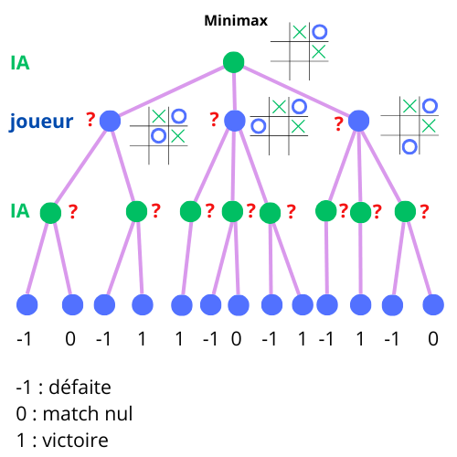

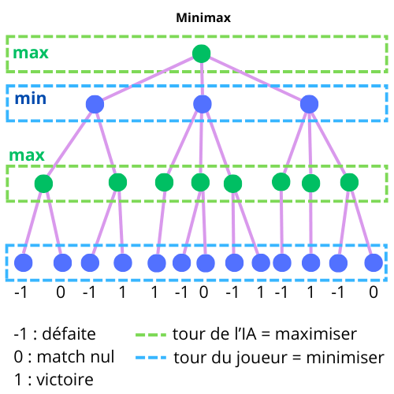

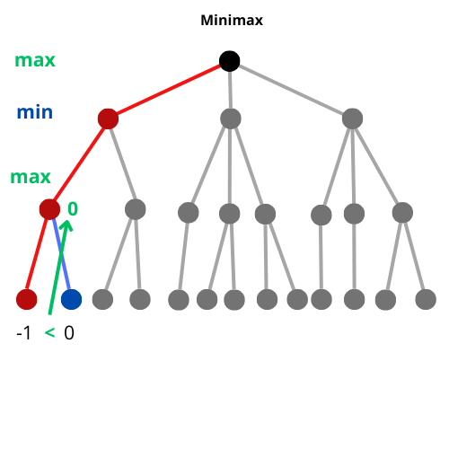

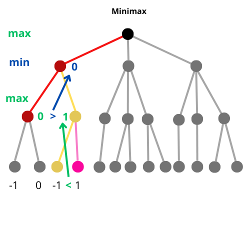

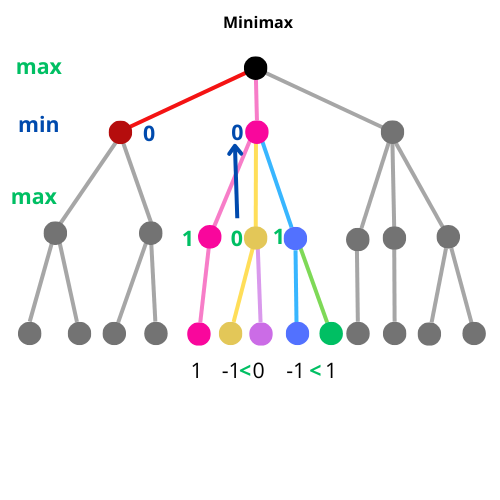

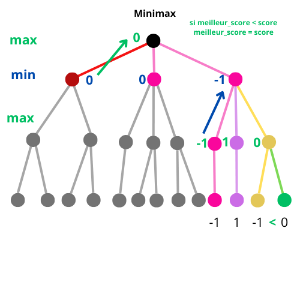

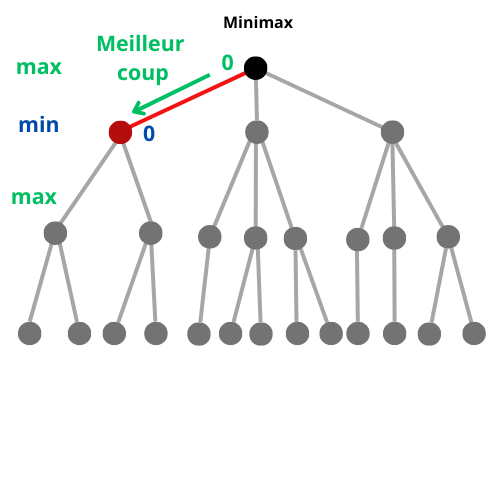

Quand on a choisit le meilleur coup, ça ne s’arrête pas là !

* On a fait l’hypothèse que le joueur adverse choisirait le meilleur coup pour lui. L’idée du minimax est de chercher à choisir le meilleur coup pour nous dans une situation où l’adversaire choisirait aussi le pire coup pour nous / le meilleur pour lui
* Mais rien ne nous dit que l’adversaire va jouer le coup attendu (idem pour la suite)
* Il faudra donc recalculer à nouveau l’arbre de jeu complet à notre prochain tour, en fonction de ce que l’adversaire aura joué, et choisir en fonction.

### Pseudocode

```
Minimax(position, profondeur, maximiser):
	si nœud_terminal == game_over alors:
		retourne evaluation_de_la_position
	
	si maximiser = vrai alors:
		score_max = -inf
		pour chaque successeur_de_la_position:
			score = minimax(successeur, profondeur+1, maximiser=faux)
			score_max = max(score_max, score)
		retourne score_max
	sinon:
		score_min = +inf
		pour chaque successeur_de_la_position:
			score = minimax(successeur, profondeur+1, vrai):
			score_min = min(score_min, score)
		retourne score_min
```

### Code en Lua

```lua
local GAIN = 1
local INF = math.huge

[…]

function game.minimax(maximize)

    -- if the move is a winning move, return GAIN value (victory score)
    if game.is_victory(game.ia_mark) then
        return GAIN
    end

    -- if the move is a losing move, return -GAIN value (defeat score)
    if game.is_victory(game.player_mark) then
        return -GAIN
    end
    
    -- if the move leads to a draw game, return 0
    if game.is_draw() then
        return 0
    end

    --[[ 
    if we are note in one this situation, we have to go deeper and start
    a DFS (recursive). the search will be performed differently depending 
    on whether we are at a stage where we need to maximize or minimize 
    (depending on whether the next move is for the player or the AI)
]]
    -- do we have to maximize ?
    if maximize then
        local best_score = -INF

        for cell_idx, cell_value in ipairs(game.board) do
           -- we will evaluate each empty cell
            if cell_value == ' ' then
           -- we simulate a move (i.e : let’s see what happens if ia play this cell)
                game.board[cell_idx] = game.ia_mark
                -- recursive call (as required in DFS)
                -- if we are at a maximize step, next step should minize (maximize = false)
                score =  game.minimax(false)
                -- once it’s done, we cancel the simulation and go back to previous state
                game.board[cell_idx] = ' '

                -- now we maximize (if new score > best score we update the best score)
                best_score = math.max(score, best_score)
            
            end

        end

        return best_score

    else
        -- we are at a minimizer step
        local best_score = INF
        -- we process almost the same as for the maximizer :
        for cell_idx, cell_value in ipairs(game.board) do
            -- we evaluate empty cells
            if cell_value == ' ' then
                game.board[cell_idx] = game.player_mark
                -- recursive call (next step should maximize this time)
                score = game.minimax(true)
                -- once it’s done, we cancel the simulation and go back to game previous state
                game.board[cell_idx] = ' '

                -- now we minimize (if new score < best score we update the best score)
                best_score = math.min(score, best_score)

            end

        end

        return best_score

    end

end
```

### Minimax et profondeur

Pour simplifier nous avons considéré que la fin de la partie serait à chaque fois atteinte dans le même nombre de coup. Ce n’est réellement jamais le cas, notamment parce qu’une victoire (de l’un ou l’autre camp) met fin prématurément à la partie, et qu’une victoire peut être plus ou moins rapide. Par exemple :

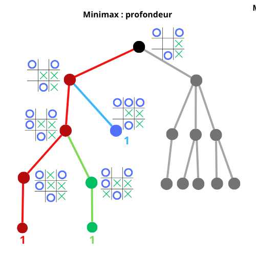

Dans tous les cas la victoire est assurée dans la branche de gauche, mais on voit bien qu’une victoire est immédiate dans un cas, et demande un échange de plus dans l’autre.

Si ce genre d’alternative se présentait – si on devait choisir entre plusieurs branches, à l’inverse de l’exemple ci-dessus où la même branche conduit immanquablement à la victoire, en fait le coup de l’adversaire est ici mauvais, mais c’est pour  l’exemple – rien dans l’algorithme n’indiquerait qu’il faut choisir l’une ou l’autre option, qui sont équivalente dans leur finalité. Il est pourtant plus intéressant de choisir une victoire rapide, ne serait-ce que pour limiter les chances de l’adversaire de s’en sortir. 

#### Code pour prendre en compte la profondeur

Un moyen simple et efficace pour prendre en compte la profondeur de jeu dans nos choix et l’évaluation des situations de jeu, consiste à faire intervenir la profondeur de chaque branche dans le score.

Pour le moment on a affecté les valeurs suivantes aux fin de jeu : -1 pour une défaite, 0 pour un nul, et 1 pour une victoire. Nous avons donc défini une constante `GAIN = 1` dont il suffisait de prendre l’opposé pour évaluer la situation de l’adversaire. Ainsi, notre score (fonction d’évaluation) était défini ainsi : `score = GAIN` ou `score = -GAIN`.  Si nous créions une variable `depth` qui conterait le nombre de niveau que l’on parcours (simplement le nombre de fois où nous faisons un appel récursif, chaque nouvel appel correspondant à un niveau supplémentaire). `depth` aurait alors une valeur entière type 1, 2, 3, 4… etc. jusqu’au nombre maximum de niveaux atteignable (qui diminue plus le jeu avance, par ailleurs).

On pourrait définir le score ainsi : `score = GAIN - depth` (ou l’opposé selon l’adversaire considéré). En effet, on veut qu’une victoire rapide obtienne un score supérieur à celui d’une victoire moins rapide (au bout d’un nombre de coups plus grand, soit une plus grande profondeur). Plus la profondeur est grande, et plus le score doit être petit, d’où la soustraction.

Cela pose une contrainte sur `GAIN` qui doit être plus important que la profondeur maximale atteignable, ici nous pourrons prendre 10 (vu qu’il y a 9 coups à jouer).

Ainsi, nous pouvons modifier notre code ainsi : 

```lua
GAIN = 10
[…]
-- on ajoute un argument depth à la fonction minimax() :

function game.minimax(maximize, depth)

    -- if the move is a winning move, return GAIN value (victory score)
    if game.is_victory(game.ia_mark) then
        return GAIN - depth
    end

    -- if the move is a losing move, return -GAIN value (defeat score)
    if game.is_victory(game.player_mark) then
        return -GAIN + depth
    end
    
    -- if the move leads to a draw game, return 0
    if game.is_draw() then
        return 0
    end
    
    […]
    
 -- Bien sûr il ne faut pas oublier d’incrémenter depth de 1 quand on fait un appel récursif :
    
    score = game.minimax(depth+1, false) -- par exemple dans le cas d’un appel min
    
 -- et penser à mettre depth = 0 au premier appel de minimax, dans la fonction game.ia_turn()   
```

Modifier le programme selon ces indications à titre d’exercice.

#### Arbres de jeux trop profonds

Par ailleurs, la profondeur de l’arbre de jeu peut poser un autre problème.

En prenant pour exemple le jeu de morpion, nous avons choisit un jeu dont le nombre de possibilité est assez limité (tout de même 9! soit 362 880 tout de même), on peut parfaitement représenter ou calculer l’entièreté de l’arbre jusqu’aux feuilles (les nœuds finaux) qui correspondent à l’état final du jeu, victoire ou match nul. Dans d’autres jeux, comme les échecs, c’est impossible. Il faut donc limiter le nombre de coups que l’on peut « descendre » avec cet algorithme (Deep Blue calculait 12 coups à l’avance) pour conserver un temps de calcul raisonnable. Problème, dans ce cas on ne sait pas vers quel état final (victoire, défaite, nul ?) les branches que l’on emprunte nous amèneront. Il faut alors employer des *heuristiques* pour évaluer la qualité de la situation de jeu à laquelle nous seront parvenu (position favorable, nombre de pièces capturées, capacité de mouvement, défense, etc.)

On peut simplement modifier la fonction minimax ainsi :

```lua
function game.minimax(maximize, depth)
    
    -- if the move is a winning move, return GAIN value (victory score)
    if game.is_victory(game.ia_mark) then
        return GAIN - depth
    end
    
    -- if the move is a losing move, return -GAIN value (defeat score)
    if game.is_victory(game.player_mark) then
        return -GAIN + depth
    end
    
    -- if the move leads to a draw game, return 0
    if game.is_draw() then
        return 0
    end
    
    -- Limit the depth of search
    if depth > depth_max then
        return HEURISTIC_FUNCTION() -- if you can build an heuristic, or a default score value
    end
```

La définition de l’heuristique est alors centrale : tout repose sur la capacité à trouver ou construire de bonnes heuristiques pour évaluer la situation de jeu.

## Alpha-beta pruning

*Pruning* signifie élagage : on va en effet améliorer le temps d’exécution de minimax pour trouver une réponse plus rapidement en évitant d’explorer systématiquement toutes les situations de jeu possibles, comme si on avait coupé ou supprimé purement et simplement des branches de notre arbre de recherche.

Comment procède-t-on à cette suppression ?

Imaginons la situation (simplifiée) suivante :


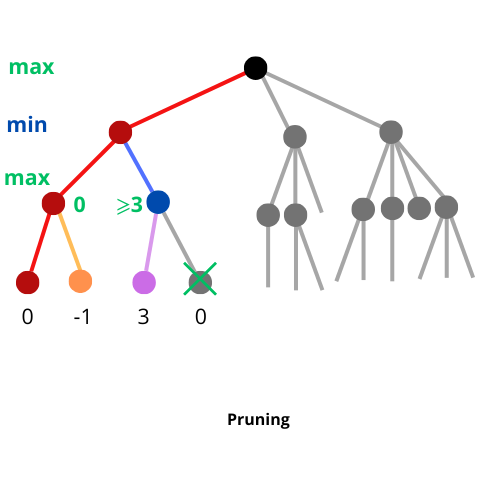

Si on regarde le dernier niveau à maximiser, sur la branche de gauche on sait que le max est 0, du moment ou avec un DFS on a vu la valeur 3, on sait que si on doit maximiser il est inutile d’aller explorer le reste de la branche car 3 est déjà supérieur au score de la branche de gauche.

Et ce, d’autant que le nœud supérieur (parent) va minimiser, et donc sélectionner le score 0 de la branche de gauche. Dans tous les cas la branche la plus à droite ici ne nous apportera jamais une information intéressante : on peut l’ignorer.

Pour systématiser cette observation, on va se doter de deux variables : alpha et béta, que l’on va calculer pour chaque nœud de l’arbre.

* alpha va stocker le score le plus élevé qu’une couche max aura reçu (alpha ne peut voir sa valeur modifiée que dans une couche max). On va démarrer avec la valeur la plus petite possible : - infini.
* béta va stocker le score le plus bas qu’une couche min aura reçu (béta ne peut voir sa valeur modifiée que dans une couche mini). Sa valeur de départ sera la plus grande possible : + infini.

Alpha va nous permettre d’identifier la meilleure possibilité du point de vue d’une couche max, et béta du point de vue d’une couche min. Ces variables seront évaluées à chaque appel d’une fonction minimax (appels récursifs), et donc héritées des nœuds parent (vu qu’on explore l’arbre de haut en bas). Dès que alpha sera supérieure à béta : on peut ignorée la branche que l’on explore !

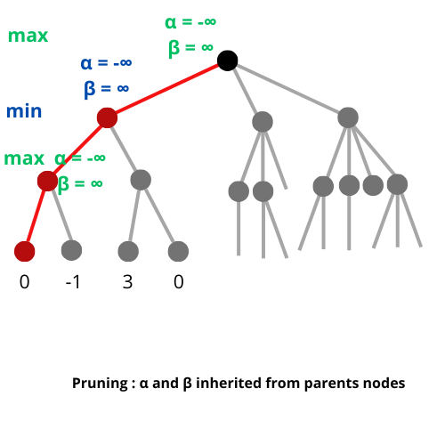

Quand on parcours une branche, les valeurs de départ de α et β (infinie au départ) sont héritées par les nœuds de la branche au fur et à mesure des appels récursifs.

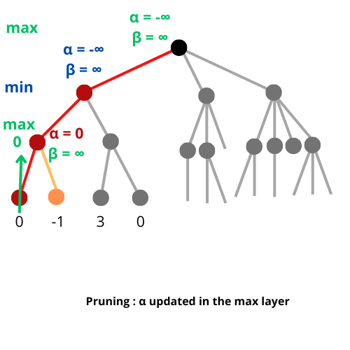

Arrivée à un nœud terminal, on a la valeur de l’état final, dont α ou β vont hériter (en fonction de si la couche est max ou min, ici c’est max). Bien sûr la valeur est aussi maximisée comme dans le minimax classique. Ici α prend donc la valeur 0 et β reste infini.

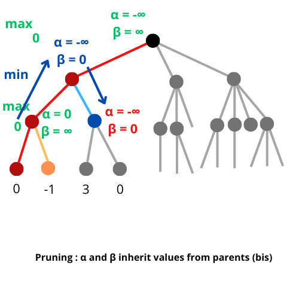

Quand les fonctions récursives appelées retournent leurs valeurs (score), elles permettent aux fonctions « parents » qui les ont appelées, de mettre à jour les valeurs de leurs α et β (selon qu’elles sont min ou max), qui à leur tour passent ces valeurs en arguments aux fonctions qu’elles appellent récursivement pour explorer d’autres branches.

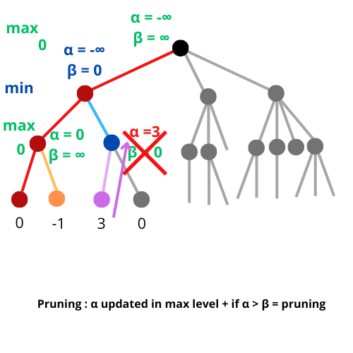

En arrivant à un nouveau nœud terminal, la valeur de α (ici) peut être mise à jour, et comparée à celle de β : si α > β, alors on peut arrêter d’explorer la branche (*pruning*).

Ce principe exposé, voyons comment on peut le coder (pas de panique, ce sont juste quelques lignes de code très simples).

### Code

On va simplement ajouter des arguments `alpha` et `beta` à notre fonction `game.minimax()`

```lua
function minimax(maximize, depth, alpha, beta)
--[[don’t forget to initialize alpha and beta at –INF and INF respectively 
    when you first call minimax in the game.turn_ia() function
    along with depth = 0 :
    score =  game.minimax(false, 0, alpha, beta)
    ]]
    
    […]
    -- in the maximize section, after the call of minimax :
      if maximize then
        local best_score = -INF

        for cell_idx, cell_value in ipairs(game.board) do
           -- we will evaluate each empty cell
            if cell_value == ' ' then
           -- we simulate a move (i.e : let’s see what happens if ia play this cell)
                game.board[cell_idx] = game.ia_mark
                -- recursive call (as required in DFS)
                -- if we are at a maximize step, next step should minize (maximize = false)
                score =  game.minimax(false, depth+1, alpha, beta)
                -- once it’s done, we cancel the simulation and go back to previous state
                game.board[cell_idx] = ' '

                -- now we maximize (if new score > best score we update the best score)
                best_score = math.max(score, best_score)
                
                alpha = math.max(alpha, score)
                    -- pruning
                    if alpha >= beta:
                        break -- we won’t visit following nodes of our current position
            
            end

        end

        return best_score
[…]
            
            -- and of course instruction in the minimizer section, according to the condition of pruning in this case
            -- your code !
            
            

```

Modifier le programme à partir de ces indications à titre d’exercice, et pour bien comprendre la technique de l’*alpha-beta pruning*.
